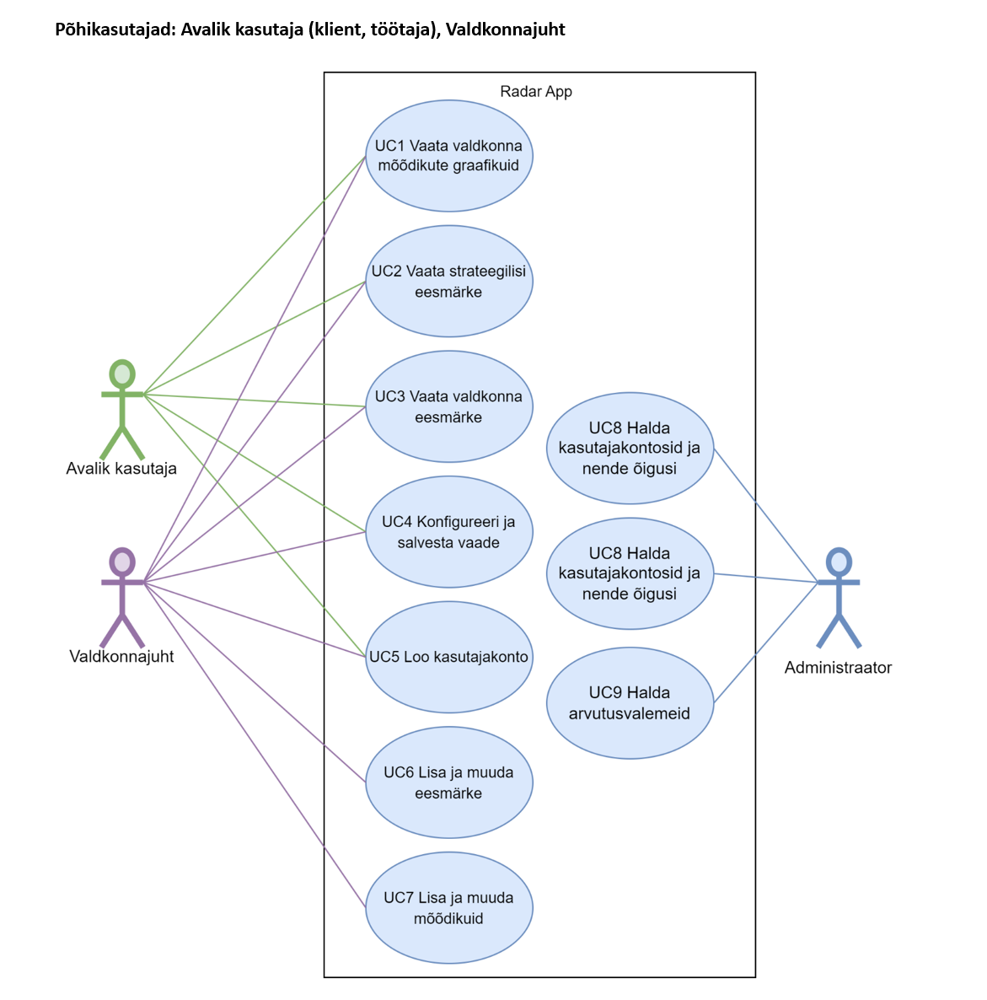

# radar-app

Radar App is a web application designed for visualizing and managing business campus data. The platform provides interactive dashboards for tracking metrics and business goals, enabling a more data-focused decision making for business campus development.

## Features

*   Interactive dashboard for visualizing and managing business campus data.
*   Users can add, modify, and update metrics, goals, and dashboards.

## Technologies Used

*   **Backend:** PHP (Yii2 framework)
*   **Frontend:** JavaScript, Bootstrap
*   **UI Design:** Figma
  
### Metrics

### Goals

### Use Cases

## My Role

*   Defined user interface functionality requirements.
*   Created use cases and outlined data sources.
*   Collected, cleaned, and structured data for the database.
*   Refactored the database schema to optimize data management.
*   Designed static UI prototypes in Figma.
*   Developed the frontend for the application.
